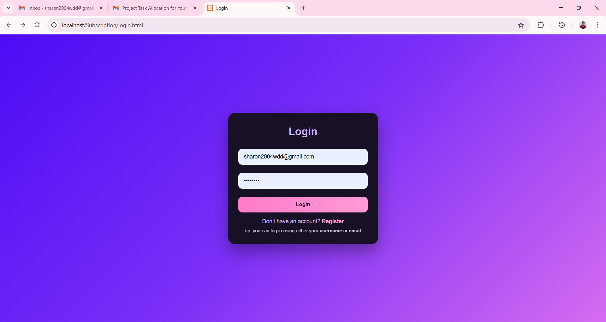
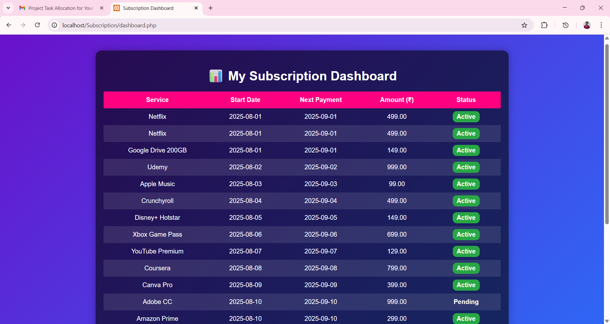
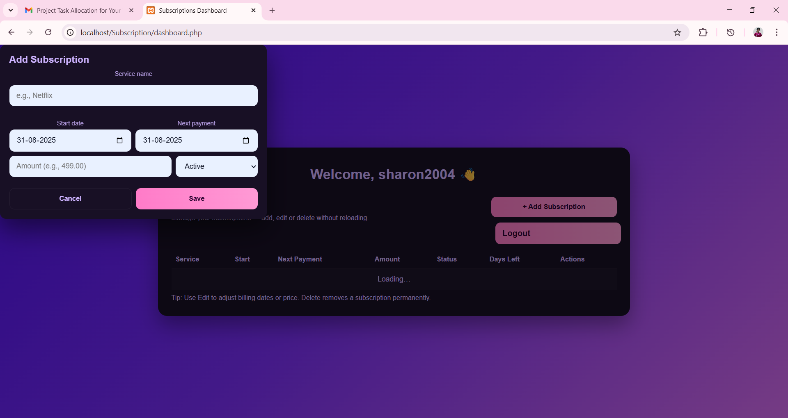
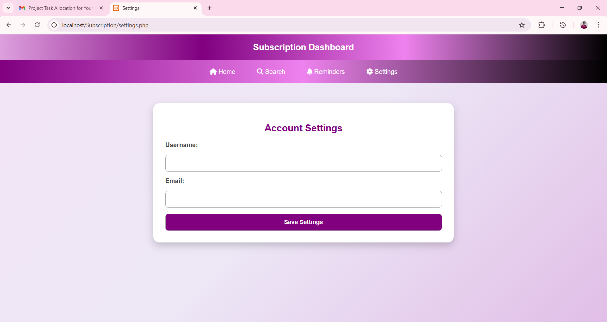

# Subscription Management System

## Overview
The Subscription Management System is a web-based platform designed to help users manage their active subscriptions efficiently. It allows users to add, update, delete, and view subscriptions, track upcoming payments, and receive reminders. The system also provides a clean and responsive dashboard for ease of use.

## Features
- User authentication (login & registration)
- Add, edit, and delete subscriptions
- Dashboard to view all active subscriptions
- Notifications and reminders for upcoming payments
- Search and filter functionality
- Settings page for user preferences

## Setup Instructions
1. **Clone the repository**
   ```bash
   git clone https://github.com/SharonGwen/subscription-management-system.git
   ```

2. **Move project to server folder**
   - If using XAMPP, place the project folder in `htdocs/`.

3. **Database setup**
   - Open `phpMyAdmin`.
   - Create a database (e.g., `subscription_db`).
   - Import the `.sql` file from the project folder to set up the tables.

4. **Configure database connection**
   -  `config.php` with database details:
     ```php
     <?php
     $host = "localhost";
     $user = "root";
     $pass = "";
     $dbname = "subscription_db";
     $conn = mysqli_connect($host, $user, $pass, $dbname);
     if (!$conn) {
         die("Connection failed: " . mysqli_connect_error());
     }
     ?>
     ```

5. **Run the project**
   - Open browser and go to: `http://localhost/subscription/index.php`

## Usage
- Register as a new user.
- Log in to access your dashboard.
- Add your subscriptions with details like name, amount, and billing date.
- View and manage all subscriptions in one place.

## Screenshots
### login


### Dashboard


### Add Subscription


### settings


## Links
- **GitHub Repository:** [https://github.com/SharonGwen/subscription-management-system](https://github.com/SharonGwen/subscription-management-system)
- **Project Live (Localhost):** [http://localhost/subscription](http://localhost/subscription)
